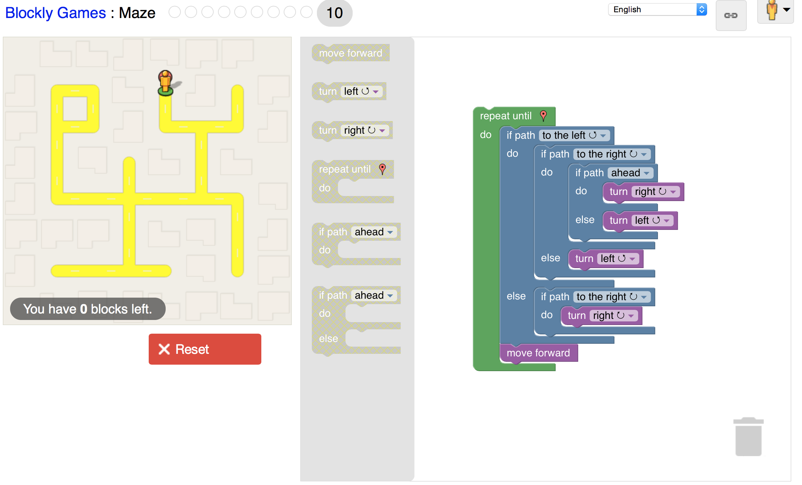

## c. 2.
1. Point the user to useful documentation relevant to the question for their own research.
2. Take the users experience in account when writing your answer. The right answer is unhelpful to someone who can't understand it.
## c. 3.
It is silly to try and argue against any large corporations efforts to defend their intellectual property, however the real question is whether or not this person (Jesse) was attempting to jeopardize that property. It is impossible, at least from only outside information, to determine if Jesse meant to create this program in order to encourage file sharing, this is what a court case would decide. Unfortunately, the problem of the current court system then arises. The court system, in todays world, is not for the benefit of regular people, it has become a tool for huge corporations and people with large amounts of money to exert their will on others.  Not to say that the court system is corrupt and useless, or that regular people are not assisted by it regularly, but that as a byproduct of it's design it favors those with excess resources over those who are acting in the right. Unfortunately, there isn't a easy solution, and the best course of action is to steer clear of large corporations or make sure you are acting anonymously when doing something that could you get in trouble. While in my personal opinion it isn't fair what happened to Jesse, life isn't fair, and I respect that he chose to become a activist to fight the issues that caused his problem, as that is the only thing that can help.

## e. 2.

## e. 3.

## f. 1.

## g. 2.
Something that interests me is blocking google from tracking things like search term patterns, mouse movements and ad engagement. I read a article about the level of tracking going on and I think I have a solution. I want to write a plugin which will randomly search terms in google, then move and click the mouse around realistically in order to obfuscate my true browsing patterns. The problem then comes about is this legal, as google essentially makes plenty of money off of this sort of tracking and targeting ad practices. Additionally, I believe it would be easy for google to figure out which periods of time were controlled by the plugin, meaning using it would be useless.
