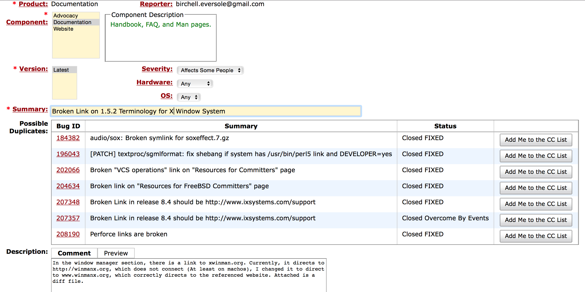
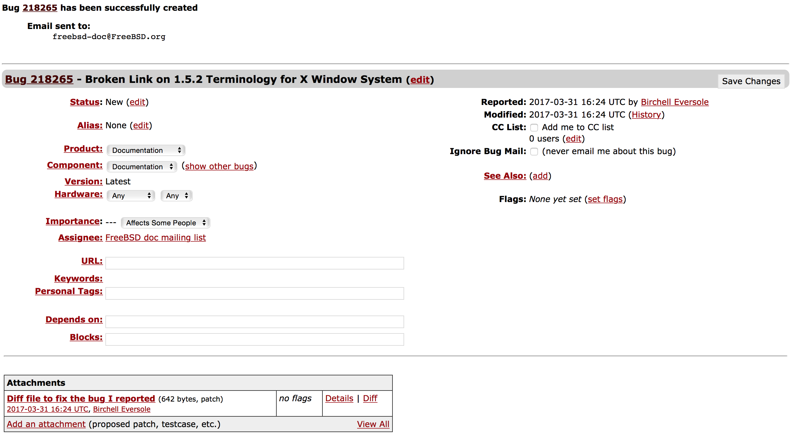

## Questions

I changed a broken web link from http://xwinman.org, to www.xwinman.org, as the first one didn't correctly load the desired site

Documentation is important because once a portion of code is written, it is very difficult to understand its functionality unless you go through every line of code (which isn't feasible, and basically removes the usefulness of open source), which is why documentation is written, so the person who created the code can outline the specifications of the code, how it can be used, and other important notes. Without documentation, the code you have written becomes useless to everyone but you.

I learned how expansive some of the manuals of the largest open source libraries are, and how it is very simple to find simple typos and broken websites, as with a documentation file that large, small things are bound to go wrong.

## Bug Submission

